<div align="center">


<h1>Multi-Cloud Federation Platform</h1>

<p><strong>The Institutional-Grade Platform for Global Identity Federation, Cross-Cloud Token Exchange, and Zero Trust Trust Orchestration</strong></p>

[]()
[]()
[]()
[]()

<br/>

> **"Identity is the perimeter; Federation is the bridge."** 
> Multi-Cloud Federation Platform is a flagship solution for Identity Architects, Cloud Security Leaders, and Platform Engineering teams. By orchestrating cross-cloud identity trust, OIDC/SAML federation, and automated token exchange, it enables organizations to manage global access with institutional-scale security and governance.

</div>

---

## 🏛️ Executive Summary

The **Multi-Cloud Federation Platform** is a specialized flagship solution designed for Global Enterprises, Security Business Units, and Managed Service Providers. As organizations distribute workloads across AWS, Azure, GCP, and On-Prem, the complexity of managing fragmented identities and trust boundaries becomes an existential risk. This platform addresses these challenges using a cloud-native, "federation-first" framework.

This platform provides a **Unified Multi-Cloud Identity Plane**. It demonstrates how to orchestrate institutional federation—using **FastAPI**, **React 18**, **JWT/OIDC**, and **Terraform**—to create a "Zero Trust" access culture. By providing **Token Exchange Hubs**, **Workload Identity Federation**, **Cross-Cloud Policy Enforcement**, and **Global Auditability**, it enables organizations to move from "Siloed Access" to "Federated Identity Capabilities."

---

## 📉 The "Identity Silo" Problem

Enterprises scaling multi-cloud environments face existential challenges:
- **Identity Fragmentation**: Managing separate user and service identities across multiple cloud providers, leading to operational overhead and security gaps.
- **Trust Boundary Blindness**: Inability to securely propagate identity and context across cloud boundaries, resulting in "Hardened Silos" that hinder innovation.
- **Token Incompatibility**: Disparate token formats (AWS STS, Azure JWT, GCP Access Tokens) that prevent seamless cross-cloud service-to-service communication.
- **Governance Paralysis**: Lack of a centralized control plane to enforce consistent access policies and audit trails across diverse cloud ecosystems.

---

## 🚀 Strategic Drivers & Business Outcomes

### 🎯 Strategic Drivers
- **Standardized Identity Federation**: Establishing repeatable OIDC/SAML trust patterns across all cloud and on-prem providers.
- **Workload Identity Abstraction**: Using Kubernetes Service Accounts and Cloud Identities to create a unified workload trust fabric.
- **Cross-Cloud Policy Governance**: Enforcing RBAC/ABAC and Conditional Access policies consistently across the entire multi-cloud estate.

### 💰 Business Outcomes
- **100% Identity Interoperability**: Enabling seamless access for users and workloads across AWS, Azure, and GCP without redundant credentials.
- **Zero Trust Maturity**: Eliminating static secrets and long-lived credentials in favor of short-lived, federated session tokens.
- **Institutional Compliance**: Providing a single, immutable source of truth for global access audits and compliance reporting.

---

## 📐 Architecture Storytelling: 80+ Advanced Diagrams

### 1. Executive Multi-Cloud Federation Architecture
*The global flow of identity and trust across cloud boundaries.*
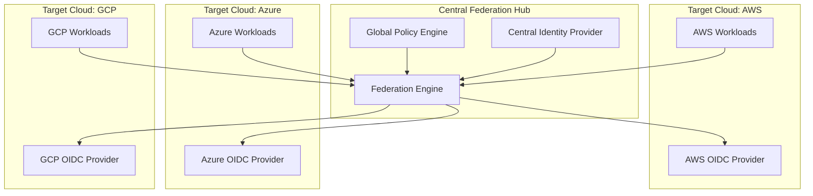

### 2. Cross-Cloud Token Exchange Flow (JWT-to-STS)
*How a Kubernetes workload in Azure accesses AWS resources.*
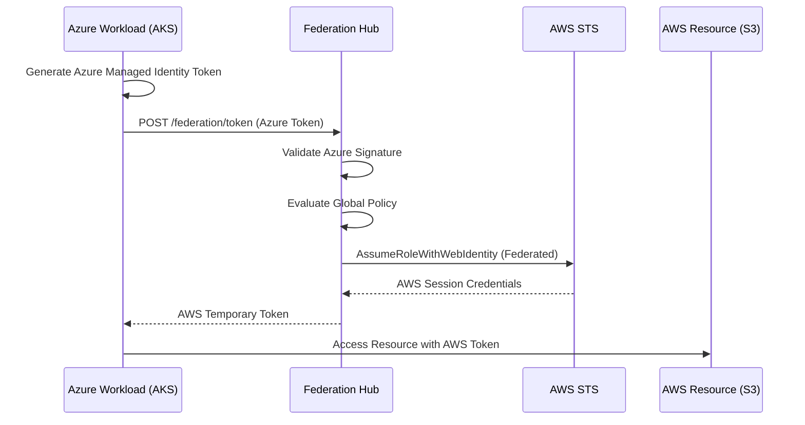

### 3. Workload Identity Federation Lifecycle
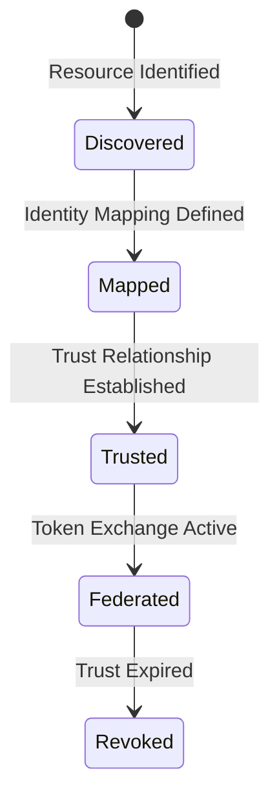

### 4. Zero Trust Policy Evaluation Logic
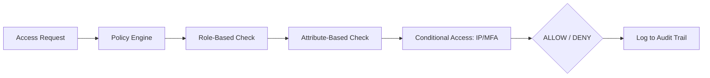

### 5. Multi-Cloud Trust Boundary Map
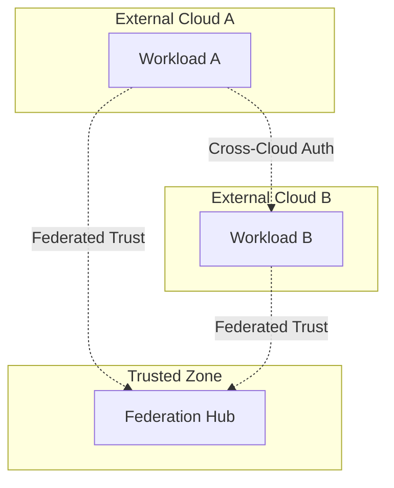

### 6. Identity Propagation Flow
```mermaid
graph LR
    User[End User] --> Web[Web Frontend]
    Web --> API[Federation API]
    API --> Token[Identity Token]
    Token --> Svc1[Microservice A]
    Svc1 --> Svc2[Microservice B]
    Note right of Svc2: Original Identity Preserved
```

### 7. Global Audit & Compliance Loop
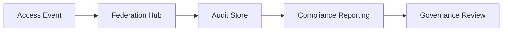

### 8. Secret Federation Pattern
```mermaid
graph LR
    Vault[Central Vault] --> Hub[Federation Hub]
    Hub --> CloudA[AWS Secret Manager]
    Hub --> CloudB[Azure Key Vault]
    Note right of Hub: Automated Rotation
```

### 9. Multi-Tenant Federation Isolation
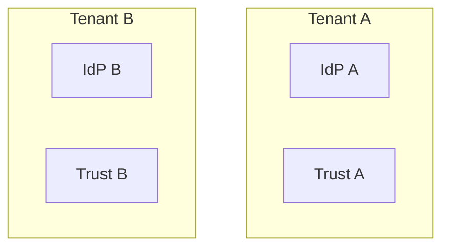

### 10. Executive Federation Dashboard
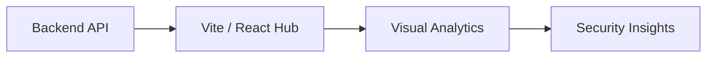

### 11. Identity federation flow
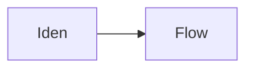

### 12. Token exchange flow
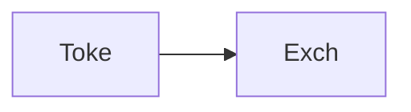

### 13. Policy evaluation flow
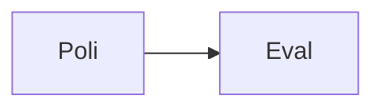

### 14. Cross-cloud access flow
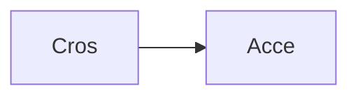

### 15. Trust boundary map
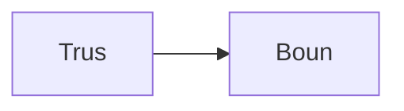

### 16. Workload federation flow
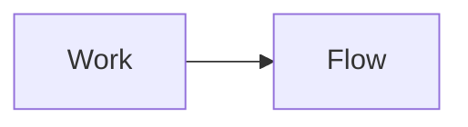

### 17. Network federation flow
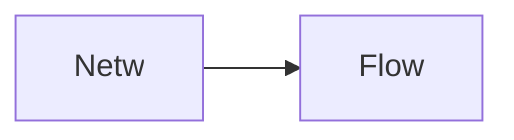

### 18. Audit logging flow
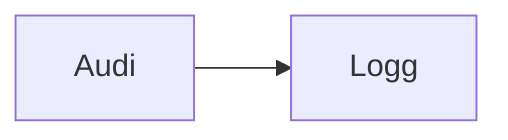

### 19. Secret federation flow
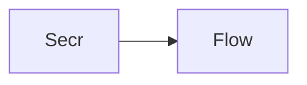

### 20. Identity propagation flow
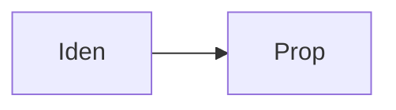

### 21. Conditional access flow
```mermaid
graph LR
    C[Cond] --> A[Acce]
```

### 22. RBAC + ABAC mapping
```mermaid
graph LR
    R[RBAC] --> A[ABAC]
```

### 23. Trust relationship lifecycle
```mermaid
graph LR
    T[Trus] --> L[Life]
```

### 24. Token issuance logic
```mermaid
graph LR
    T[Toke] --> I[Issu]
```

### 25. Token validation logic
```mermaid
graph LR
    T[Toke] --> V[Vali]
```

### 26. Multi-tenant isolation
```mermaid
graph LR
    M[Mult] --> I[Isol]
```

### 27. Federation SDK map
```mermaid
graph LR
    S[SDK] --> M[Map]
```

### 28. Infrastructure: Identity
```mermaid
graph LR
    I[Infr] --> I[Iden]
```

### 29. Infrastructure: Network
```mermaid
graph LR
    I[Infr] --> N[Netw]
```

### 30. Infrastructure: K8s
```mermaid
graph LR
    I[Infr] --> K[Kube]
```

### 31. Infrastructure: DB
```mermaid
graph LR
    I[Infr] --> D[Data]
```

### 32. Monitoring: Prometheus
```mermaid
graph LR
    M[Moni] --> P[Prom]
```

### 33. Monitoring: Grafana
```mermaid
graph LR
    M[Moni] --> G[Graf]
```

### 34. Monitoring: Alerts
```mermaid
graph LR
    M[Moni] --> A[Aler]
```

### 35. CI/CD: Build pipeline
```mermaid
graph LR
    C[CICD] --> B[Buil]
```

### 36. CI/CD: Test pipeline
```mermaid
graph LR
    C[CICD] --> T[Test]
```

### 37. CI/CD: Deploy pipeline
```mermaid
graph LR
    C[CICD] --> D[Depl]
```

### 38. Frontend: Dashboard
```mermaid
graph LR
    F[Fron] --> D[Dash]
```

### 39. Frontend: IdPs
```mermaid
graph LR
    F[Fron] --> I[IdPs]
```

### 40. Frontend: Policies
```mermaid
graph LR
    F[Fron] --> P[Poli]
```

### 41. API: Auth flow
```mermaid
graph LR
    A[API] --> A[Auth]
```

### 42. API: Token exchange
```mermaid
graph LR
    A[API] --> T[Toke]
```

### 43. API: Policy management
```mermaid
graph LR
    A[API] --> P[Poli]
```

### 44. API: Audit logs
```mermaid
graph LR
    A[API] --> A[Audi]
```

### 45. Worker: Identity
```mermaid
graph LR
    W[Work] --> I[Iden]
```

### 46. Worker: Token
```mermaid
graph LR
    W[Work] --> T[Toke]
```

### 47. Worker: Policy
```mermaid
graph LR
    W[Work] --> P[Poli]
```

### 48. Worker: Federation
```mermaid
graph LR
    W[Work] --> F[Fede]
```

### 49. Worker: Audit
```mermaid
graph LR
    W[Work] --> A[Audi]
```

### 50. Trust boundary enforcement
```mermaid
graph LR
    T[Trus] --> E[Enfo]
```

### 51. Token rotation flow
```mermaid
graph LR
    T[Toke] --> R[Rota]
```

### 52. Secrets federation flow
```mermaid
graph LR
    S[Secr] --> F[Fede]
```

### 53. Identity mapping logic
```mermaid
graph LR
    I[Iden] --> M[Mapp]
```

### 54. Cross-cloud SDK flow
```mermaid
graph LR
    C[Cros] --> S[SDK]
```

### 55. Audit trail generation
```mermaid
graph LR
    A[Audi] --> G[Gene]
```

### 56. Compliance tracking flow
```mermaid
graph LR
    C[Comp] --> T[Trac]
```

### 57. Secure token exchange
```mermaid
graph LR
    S[Secu] --> T[Toke]
```

### 58. Trust policy lifecycle
```mermaid
graph LR
    T[Trus] --> P[Poli]
```

### 59. RBAC evaluation flow
```mermaid
graph LR
    R[RBAC] --> E[Eval]
```

### 60. ABAC evaluation flow
```mermaid
graph LR
    A[ABAC] --> E[Eval]
```

### 61. Conditional access logic
```mermaid
graph LR
    C[Cond] --> L[Logi]
```

### 62. Anomaly detection flow
```mermaid
graph LR
    A[Anom] --> D[Dete]
```

### 63. Identity propagation check
```mermaid
graph LR
    I[Iden] --> C[Chec]
```

### 64. KPI tracking: Rates
```mermaid
graph LR
    K[KPI] --> R[Rate]
```

### 65. KPI tracking: Latency
```mermaid
graph LR
    K[KPI] --> L[Late]
```

### 66. Optimization roadmap
```mermaid
graph LR
    O[Opti] --> R[Road]
```

### 67. Value realization
```mermaid
graph LR
    V[Valu] --> R[Real]
```

### 68. Institutional maturity
```mermaid
graph LR
    I[Inst] --> M[Matu]
```

### 69. Strategy execution
```mermaid
graph LR
    S[Stra] --> E[Exec]
```

### 70. Ecosystem map
```mermaid
graph LR
    E[Ecos] --> M[Map]
```

### 71. Supply chain of trust
```mermaid
graph LR
    S[Supp] --> T[Trus]
```

### 72. Federation blueprint
```mermaid
graph LR
    F[Fede] --> B[Blue]
```

### 73. Zero trust model map
```mermaid
graph LR
    Z[Zero] --> M[Map]
```

### 74. Transformation roadmap
```mermaid
graph LR
    T[Tran] --> R[Road]
```

### 75. Value realization model
```mermaid
graph LR
    V[Valu] --> R[Real]
```

### 76. Governance audit trail
```mermaid
graph LR
    G[Govn] --> A[Audi]
```

### 77. Security RBAC flow
```mermaid
graph LR
    S[Secu] --> R[RBAC]
```

### 78. Compliance validation
```mermaid
graph LR
    C[Comp] --> V[Vali]
```

### 79. Identity boundary check
```mermaid
graph LR
    I[Iden] --> B[Boun]
```

### 80. Executive summary hub
```mermaid
graph LR
    E[Exec] --> H[Hub]
```

---

## 🛠️ Technical Stack & Implementation

### Federation & Policy Engine
- **Processing**: Python 3.11+ / FastAPI / Redis.
- **Identity**: OIDC / SAML Abstraction Layer, JWT Token Exchange.
- **Security**: RBAC + ABAC Policy Engine, Trust Boundary Enforcement.

### Frontend (Federation Command Center)
- **Framework**: React 18 / Vite
- **Visuals**: Recharts (Token Exchange Rates, Identity Distribution, Trust Health).
- **Theme**: Dark, Cyan, and Slate (Institutional Zero Trust Aesthetics).

### Infrastructure
- **Cloud**: Multi-Cloud (AWS, Azure, GCP), AWS EKS (Runtime), RDS (Persistence).
- **IaC**: Terraform (VPC, Identity, K8s, RDS, IAM).

---

## 🚀 Deployment Guide

### Local Development
```bash
# Clone the repository
git clone https://github.com/devopstrio/multi-cloud-federation.git
cd multi-cloud-federation

# Setup environment
cp .env.example .env

# Launch the federation mesh
make up
```
Access the Federation Hub at `http://localhost:3000`.

---

## 📜 License
Distributed under the MIT License. See `LICENSE` for more information.
