<div align="center">


<h1>Multi-Cloud Federation Platform</h1>

<p><strong>The Institutional-Grade Platform for Global Identity Federation, Cross-Cloud Token Exchange, and Zero Trust Trust Orchestration.</strong></p>

[]()
[]()
[]()

<br/>

> **"Identity is the perimeter; Federation is the bridge."** 
> **Multi-Cloud Federation** is an enterprise-grade platform designed to provide a secure, measurable, and highly automated foundation for global identity management. It orchestrates the complex lifecycle of cross-cloud trust—from OIDC/SAML trust establishment and token exchange to workload identity federation and unified zero-trust governance.

</div>

---

## 🏛️ Executive Summary

Fragmented identity silos and manual trust management are strategic operational liabilities; lack of centralized identity federation is a primary barrier to organizational security. Organizations fail to maintain a secure perimeter not because of a lack of firewalls, but because of fragmented identity standards, lack of automated token exchange, and an inability to orchestrate cross-cloud trust with operational precision.

This platform provides the **Identity Intelligence Plane**. It implements a complete **Enterprise Federation-as-Code Framework**, enabling Identity and Security teams to manage global access as a first-class citizen. By automating the establishment of cross-cloud trust boundaries and orchestrating real-time claims transformation, we ensure that every organizational asset—from public-facing customer portals to backend administrative consoles—is federated by default, audited for history, and strictly aligned with institutional zero-trust frameworks.

---

## 📐 Architecture Storytelling: Principal Reference Models

### 1. Principal Architecture: Global Multi-Cloud Federation & Identity Intelligence Plane
This diagram illustrates the end-to-end flow from cross-cloud trust establishment and identity mapping to token exchange, authorization, and institutional identity auditing.

```mermaid
graph LR
    %% Subgraph Definitions
    subgraph IdentitySources["Identity & Trust Sources"]
        direction TB
        OnPremAD["On-Prem Active Directory"]
        AzureAD["Azure AD (Entra ID)"]
        Okta["Okta / Auth0"]
    end

    subgraph IntelligenceEngine["Identity Intelligence Hub"]
        direction TB
        API["FastAPI Federation Gateway"]
        Mapper["Claims & Attribute Mapper"]
        ExchangeHub["Token Exchange Hub (OIDC/SAML)"]
        Verifier["Signature & Trust Verifier"]
    end

    subgraph TargetClouds["Federated Cloud Fleet"]
        direction TB
        AWS["AWS IAM (Web Identity)"]
        GCP["GCP Workload Federation"]
        Kubernetes["K8s OIDC Auth"]
    end

    subgraph OperationsHub["Institutional Identity Hub"]
        direction TB
        Scorecard["Federation Maturity Score"]
        Analytics["Token Exchange & Risk Stats"]
        Audit["Forensic Identity Metadata Lake"]
    end

    subgraph DevOps["Federation-as-Code Orchestration"]
        direction TB
        TF["Terraform Federation Modules"]
        Vault["Secure Trust Storage"]
        ChatOps["Trust Approval Hub"]
    end

    %% Flow Arrows
    IdentitySources -->|1. Establish Trust| API
    API -->|2. Map Attributes| Mapper
    Mapper -->|3. Exchange Token| ExchangeHub
    ExchangeHub -->|4. Verify Trust| Verifier
    
    Verifier -->|5. Issue Federated Session| TargetClouds
    TargetClouds -->|6. Notify Success| ChatOps
    API -->|7. Visualize Health| Scorecard
    
    Scorecard -->|8. Track Auth Risk| Analytics
    Scorecard -->|9. Record Event| Audit
    
    TF -->|10. Provision Hub| IntelligenceEngine
    Vault -->|11. Inject Trust Keys| Verifier
    Audit -->|12. Improve Policies| Mapper

    %% Styling
    classDef source fill:#f5f5f5,stroke:#616161,stroke-width:2px;
    classDef intel fill:#e0f7fa,stroke:#006064,stroke-width:2px;
    classDef target fill:#e1f5fe,stroke:#01579b,stroke-width:2px;
    classDef ops fill:#ede7f6,stroke:#311b92,stroke-width:2px;
    classDef devops fill:#fffde7,stroke:#f57f17,stroke-width:2px;

    class IdentitySources source;
    class IntelligenceEngine intel;
    class TargetClouds target;
    class OperationsHub ops;
    class DevOps devops;
```

### 2. The Federation Lifecycle Flow
The continuous path of a federation trust from initial establishment and exchange to active verification, authorization, and institutional forensic auditing.

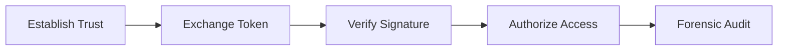

### 3. Cross-Cloud OIDC/SAML Trust Topology
Establishing an institutional trust fabric between AWS, Azure, GCP, and on-premises environments, allowing identities from any source to be securely recognized across the entire ecosystem.

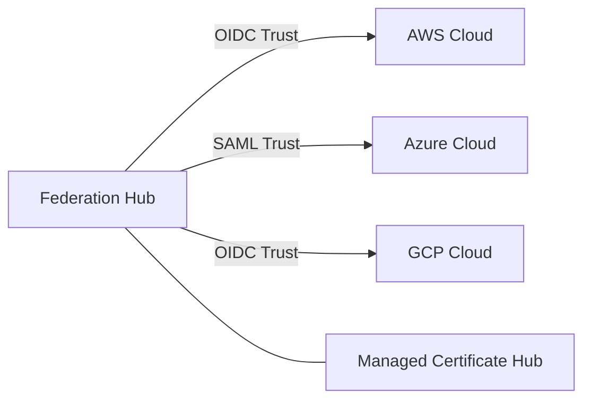

### 4. Identity Mapping & Claims Transformation Flow
Translating user attributes and group memberships between disparate cloud provider schemas (e.g., mapping an Azure AD Group to an AWS IAM Role) during the federation process.

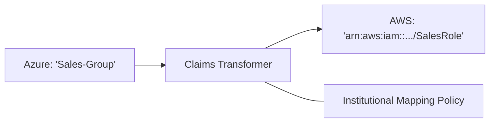

### 5. Multi-Cloud Single Sign-On (SSO) Flow
Orchestrating a unified login experience where a single set of credentials provides secure, federated access to consoles and APIs across all integrated cloud platforms.

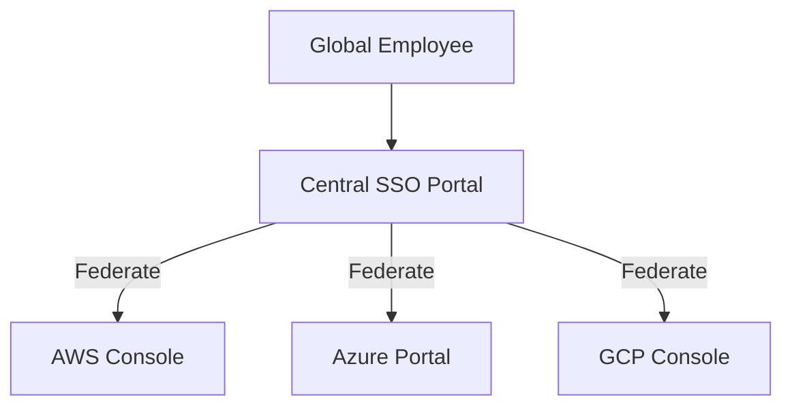

### 6. Workload Identity Federation (Workload ID) Flow
Enabling secure, secret-less machine-to-machine communication (e.g., a GitHub Action or K8s Pod accessing S3) by exchanging short-lived OIDC tokens for cloud-native credentials.

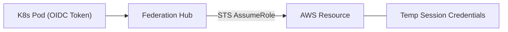

### 7. Institutional Federation Scorecard
Grading organizational performance based on key indicators: Trust Coverage, Identity Risk Score, and SSO Adoption Rate across all business units.

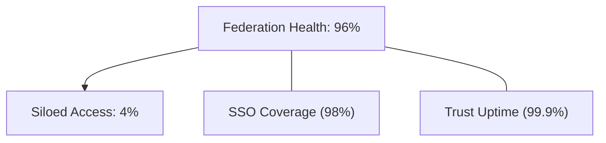

### 8. Identity & RBAC for Federation Governance
Managing fine-grained access to federation trust relationships, mapping rules, and audit logs between Identity Architects, Cloud Security Admins, and Compliance Officers.

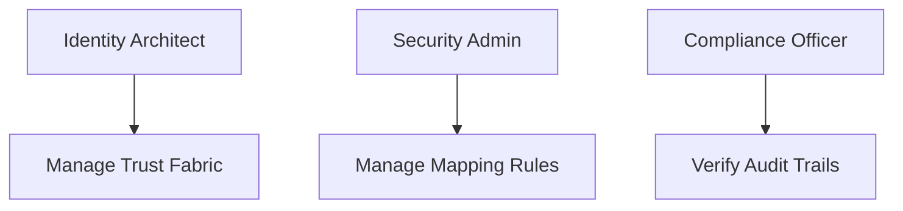

### 9. IaC Deployment: Federation-as-Code Framework
Using modular Terraform to deploy and manage the versioned distribution of the federation hubs, trust anchors, and forensic metadata lakes.

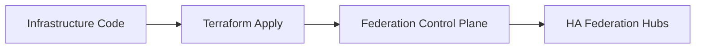

### 10. AIOps Identity Anomaly Detection Flow
Using machine learning to identify unauthorized federation attempts, attribute mismatches, or suspicious login patterns across geographic boundaries.

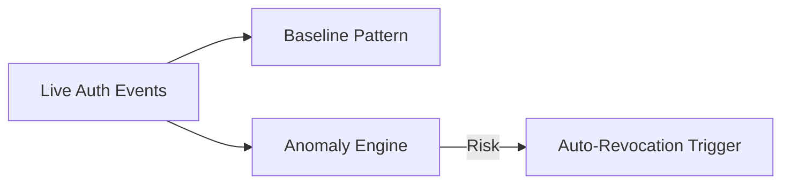

### 11. Metadata Lake for Forensic Identity Audit
Storing long-term records of every federation event, trust change, and token exchange for institutional record-keeping, compliance auditing, and post-breach forensics.

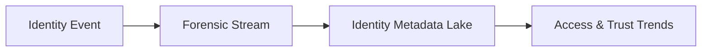

---

## 🏛️ Core Federation Pillars

1.  **Multi-Cloud Trust Abstraction**: Establishing a unified institutional model for managing AWS, Azure, and GCP trust.
2.  **Short-Lived Token Orchestration**: Eliminating static secrets in favor of dynamic, federated session tokens.
3.  **Cross-Cloud Claims Transformation**: Dynamically mapping identity context across disparate provider schemas.
4.  **Workload Identity Interoperability**: Enabling secret-less communication for distributed microservices and CI/CD.
5.  **Centralized Access Governance**: Enforcing global zero-trust policies at the federation point.
6.  **Full Identity Auditability**: Immutable recording of every federation decision and token exchange for institutional forensics.

---

## 🛠️ Technical Stack & Implementation

### Federation Engine & APIs
*   **Framework**: Python 3.11+ / FastAPI.
*   **Trust Core**: Native integration with AWS STS, Azure Managed Identity, and GCP Workload Identity.
*   **Protocol Hub**: OIDC (OpenID Connect) and SAML 2.0 implementation for cross-cloud trust.
*   **Persistence**: PostgreSQL (Metadata Lake) and Redis (Live Session Cache).
*   **Auth Orchestrator**: Federated OIDC/SAML with HashiCorp Vault for secure trust anchor management.

### Federation Dashboard (UI)
*   **Framework**: React 18 / Vite.
*   **Theme**: Dark, Cyan, Slate (Modern high-fidelity identity aesthetic).
*   **Visualization**: D3.js for trust topology maps and Recharts for authentication risk trends.

### Infrastructure & DevOps
*   **Runtime**: AWS EKS or Azure Kubernetes Service (AKS).
*   **Security**: High-availability deployment of trust anchors and OIDC providers.
*   **IaC**: Modular Terraform for deploying the federation hub and trust distributions.

---

## 🏗️ IaC Mapping (Module Structure)

| Module | Purpose | Real Services |
| :--- | :--- | :--- |
| **`infrastructure/fed_hub`** | Central management plane | EKS, PostgreSQL, Redis |
| **`infrastructure/trust_anchors`** | OIDC & SAML Providers | AWS IAM, Azure AD, Vault |
| **`infrastructure/exchange`** | Token conversion engine | Python, JWT, SDKs |
| **`infrastructure/auditing`** | Forensic identity sinks | S3, Athena, Quicksight |

---

## 🚀 Deployment Guide

### Local Principal Environment
```bash
# Clone the federation platform
git clone https://github.com/devopstrio/multi-cloud-federation.git
cd multi-cloud-federation

# Configure environment
cp .env.example .env

# Launch the Federation stack
make init

# Trigger a mock OIDC trust establishment and token exchange simulation
make simulate-federation
```

Access the Federation Hub at `http://localhost:3000`.

---

## 📜 License
Distributed under the MIT License. See `LICENSE` for more information.

---
<div align="center">
  <p>© 2026 Devopstrio. All rights reserved.</p>
</div>
