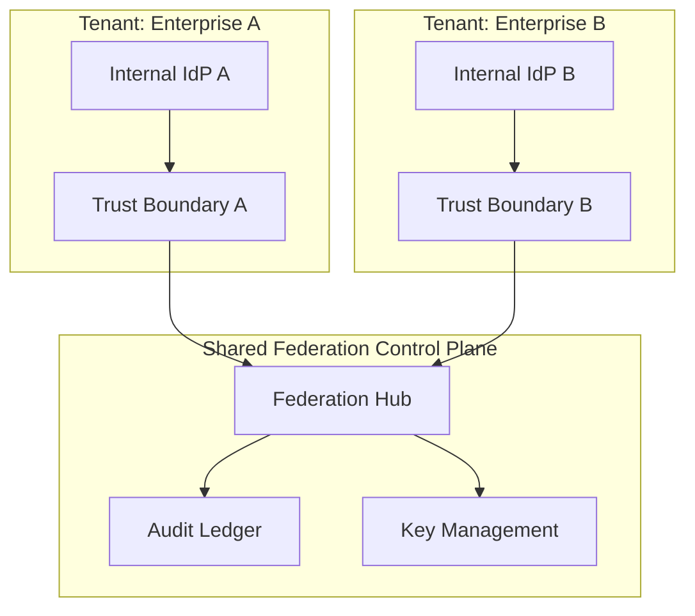
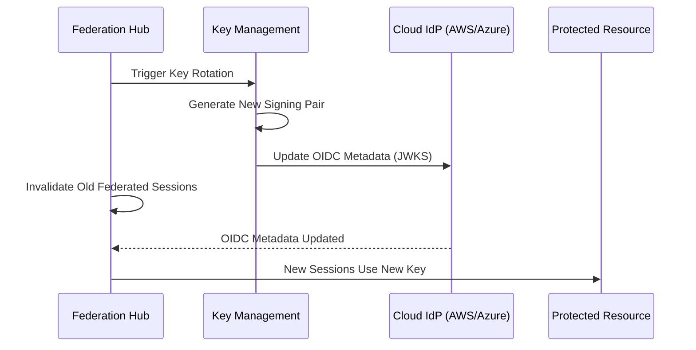
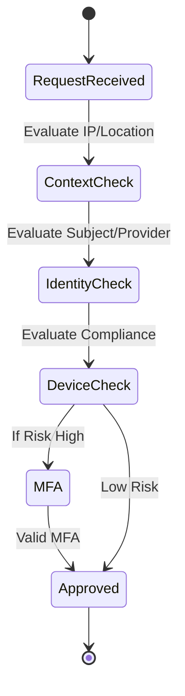

# Architecture & Security Diagrams

## 31. Multi-tenant Trust Isolation Architecture

```mermaid
graph TD
    subgraph "Tenant: Enterprise A"
        IdPA[Internal IdP A] --> BoundaryA[Trust Boundary A]
    end
    subgraph "Tenant: Enterprise B"
        IdPB[Internal IdP B] --> BoundaryB[Trust Boundary B]
    end
    subgraph "Shared Federation Control Plane"
        Hub[Federation Hub]
        Log[Audit Ledger]
        KMS[Key Management]
    end

    BoundaryA --> Hub
    BoundaryB --> Hub
    Hub --> Log
    Hub --> KMS
```

## 40. Automated Trust Rotation Flow

```mermaid
sequenceDiagram
    participant Hub as Federation Hub
    participant KMS as Key Management
    participant IdP as Cloud IdP (AWS/Azure)
    participant Res as Protected Resource

    Hub->>KMS: Trigger Key Rotation
    KMS->>KMS: Generate New Signing Pair
    KMS->>IdP: Update OIDC Metadata (JWKS)
    Hub->>Hub: Invalidate Old Federated Sessions
    IdP-->>Hub: OIDC Metadata Updated
    Hub->>Res: New Sessions Use New Key
```

## 50. Conditional Access Evaluation Flow

```mermaid
stateDiagram-v2
    [*] --> RequestReceived
    RequestReceived --> ContextCheck: Evaluate IP/Location
    ContextCheck --> IdentityCheck: Evaluate Subject/Provider
    IdentityCheck --> DeviceCheck: Evaluate Compliance
    DeviceCheck --> MFA: If Risk High
    MFA --> Approved: Valid MFA
    DeviceCheck --> Approved: Low Risk
    Approved --> [*]
```
