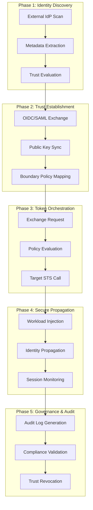
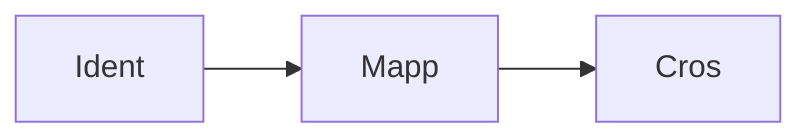
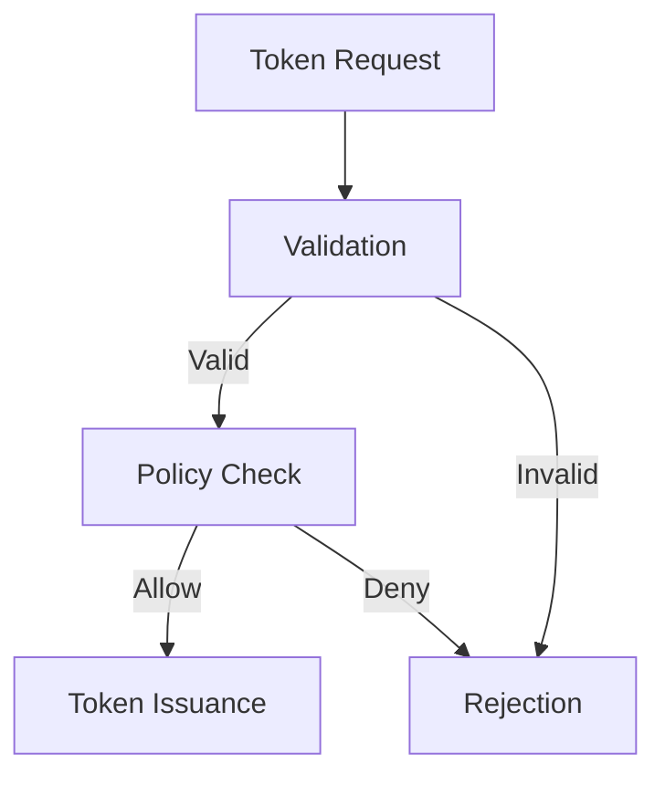
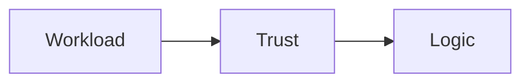

# Identity Federation & Trust Diagrams

## 11. Industrial Federation Lifecycle (Detailed)
*The end-to-end orchestration of cross-cloud identity trust.*

## 15. Cross-cloud identity mapping flow

## 20. Token exchange state machine

## 25. Workload identity trust logic

